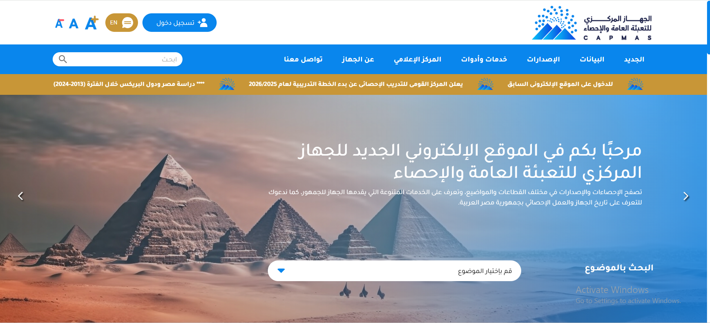
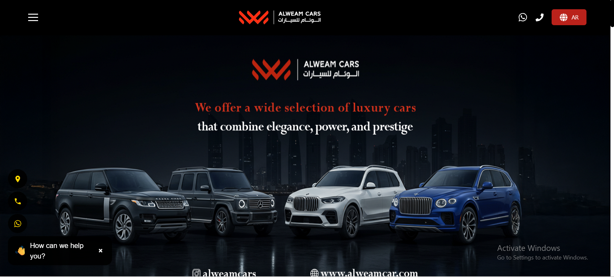
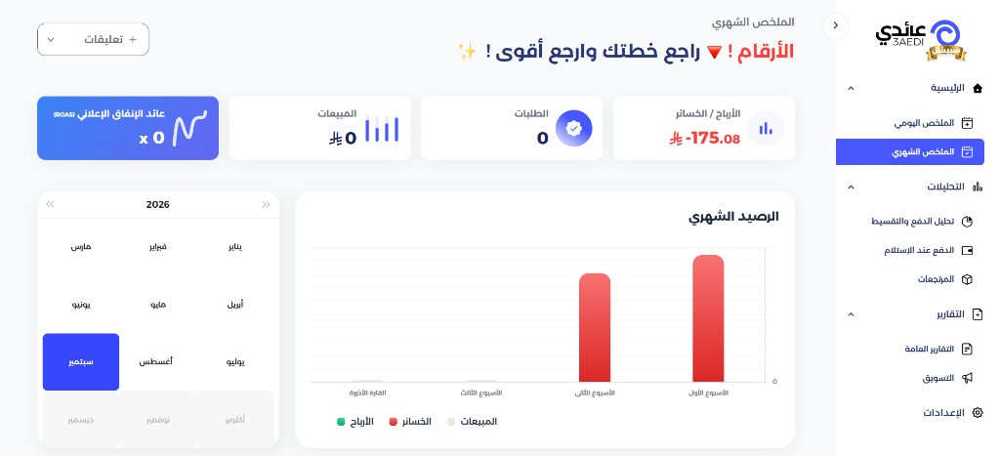

# Ahmed Rashed

**Senior Frontend Engineer** — React · Next.js · TypeScript  
Giza, Egypt · Arabic & English · RTL / LTR

I build production interfaces that survive real users, real APIs, and real deadlines. Most of my work is **frontend ownership** on government, enterprise, and commercial products — architecture, state, integrations, and bilingual UI included.

<p align="center">
  
</p>

<p align="center">
  <a href="https://ahmedrashed1619.github.io/Personal-Portfolio-website/"><strong>Live site</strong></a>
  ·
  <a href="./Ahmed%20Rashed%20-%20Front-End%20Developer%20(CV).pdf">Download CV</a>
  ·
  <a href="https://www.linkedin.com/in/ahmed-rashed-008b33221">LinkedIn</a>
  ·
  <a href="https://github.com/Ahmedrashed1619">GitHub</a>
  ·
  <a href="mailto:ahmedrashed1619@gmail.com">Email</a>
  ·
  <a href="tel:+201092999658" dir="ltr">+20 109 299 9658</a>
</p>

<p align="center">
  
  
  
  
</p>

<p align="center">
  
  
  
</p>

---

## Contents

- [English](#snapshot)
- [العربية](#العربية)
- [Snapshot](#snapshot)
- [What I am hired to do](#what-i-am-hired-to-do)
- [Featured work](#featured-work)
- [More production work](#more-production-work)
- [Tools](#tools)
- [This portfolio](#this-portfolio)
- [Run locally](#run-locally)
- [Contact](#contact)

---

## Snapshot

| | |
| --- | --- |
| **Role** | Senior Frontend Engineer |
| **Experience** | 4+ years shipping production web applications |
| **Education** | Al-Azhar University — Excellent with honors |
| **Location** | Giza, Egypt |
| **Languages** | Arabic (native), English (professional) |
| **Focus** | React / Next.js / TypeScript · dashboards · marketplaces · bilingual RTL/LTR |
| **Open to** | Full-time roles, freelance, and product collaborations |

I am not a “I also do logos and WordPress” generalist. I take frontend ownership on products that already have users, backends, and operational constraints — then make the interface reliable, fast, and maintainable.

---

## What I am hired to do

- **Own the frontend** of a product surface: public site, admin, or both
- Turn Figma into a **reusable UI system**, not a one-off page
- Wire **REST APIs**, auth, RBAC, and messy production states
- Ship **Arabic / English** products that feel native on RTL and LTR
- Build **dashboards**: KPIs, charts, maps, dense tables, live updates (SSE)
- Raise quality through **architecture, review, and mentoring** without blocking delivery

Typical process: **Scope → Interface → Integrate → Ship**.

---

## Featured work

CV order. These are the five cards that open the Work section.

### CAPMAS — Egypt’s official statistics platform

[capmas.gov.eg](https://www.capmas.gov.eg/) · Government · 2023–2025 · React, Redux Toolkit, MUI, SWR

I delivered **90%+ of the frontend** across the public website and the admin dashboard: maps, charts, content workflows, and a **streaming SSE chatbot**.

### AIO — Enterprise project management

Private platform · Enterprise · 2024 · React, Ant Design, Redux Saga, Tailwind

I owned **95%+ of the frontend** for finance, suppliers, payments, **RBAC**, and operational analytics — the kind of dense internal product teams live in all day.

### Al-Weam Cars — UAE automotive marketplace

[alweamcar.com](https://www.alweamcar.com/) · E-commerce · 2025 · React, Ant Design, React Intl

Storefront and admin in one ownership: search, trade-in, financing, and **bilingual RTL/LTR** flows for a UAE market.

### Daleel Mob — Electronics marketplace

[daleelmob.com](https://daleelmob.com/) · Marketplace · 2024 · JavaScript, Bootstrap, Axios

High-traffic catalog used by **thousands of users** to compare phones, deals, and technical articles.

### 3aedi — E-commerce profit analytics

[app.3aedi.com](https://app.3aedi.com/) · Analytics · 2025 · TypeScript, React, Chart.js

Independent product for merchant profit: sales, ads, expenses, subscriptions, and store integrations (**Salla, Zid, Meta**). Built in TypeScript.

---

## More production work

Company sites and operational dashboards beyond the featured five:

| Project | Role of the UI | Link |
| --- | --- | --- |
| Digital Hub | Company site — services, products, case studies | [digitalhub.com.eg](https://digitalhub.com.eg/) |
| Zari Main Website | Production company site | [zarisolution.com](https://zarisolution.com/) |
| Zari Loyalty | Loyalty services and company information | [zariloyalty.com](https://zariloyalty.com/) |
| Zari Falcon | Visits, tracking, and reports | [zarifalcon.com](https://zarifalcon.com/) |
| Zari On Time | Service website | [zariontime.com](https://zariontime.com/) |
| Bytrh Dashboard | Admin CRUD tables and real-time chat | [admin.bytrh.com](https://admin.bytrh.com/) |
| shaghaf | Workshop site with a contact flow | [shaghafalibdaa.com](https://shaghafalibdaa.com/) |
| Rased Tech | Smart-home and networking catalog | [rased-tech.vercel.app](https://rased-tech.vercel.app/) |

Earlier GitHub experiments (movies, weather, CRUD, Bootstrap templates) stay in **Show more work** on the site. They are practice — not the hiring case.

---

## Tools

What I use on real products, not a wish list.

**Frontend**  
JavaScript · TypeScript · React · Next.js · HTML5 · CSS3

**State & data**  
Redux Toolkit · Redux Saga · SWR · React Query · Axios · REST APIs

**UI systems**  
Sass · Tailwind · MUI · Ant Design · Bootstrap · React Intl

**Engineering**  
Git · Azure DevOps · SSE · Accessibility · Performance · Code review

---

## This portfolio

This repository is the public site: a **static** shell that presents the CV work with a product-style UI. It is not a React app and it is not a generic theme dump.

**Experience**

- Dark / light mode (`localStorage`, `prefers-color-scheme`, no flash of the wrong theme)
- Live accent colors (12 palettes + crimson default)
- Entrance loader, featured work, expandable archive
- Contact form with practical validation and EmailJS
- Responsive layout, semantic sections, keyboard-friendly theme panel

**Site stack**  
HTML5 · CSS3 (design tokens) · JavaScript · Bootstrap 5 · jQuery · Typed.js · Font Awesome · EmailJS

```text
.
├── index.html                                         # Page sections
├── css/style.css                                      # Tokens, layout, components
├── js/main.js                                         # Theme, loader, form, EmailJS
├── img/                                               # Project captures and brand
├── Ahmed Rashed - Front-End Developer (CV).pdf
└── README.md
```

---

## Run locally

No bundler. Serve the folder so hashes, fonts, and the contact form behave like production.

```bash
npx serve .
```

Live: [ahmedrashed1619.github.io/Personal-Portfolio-website](https://ahmedrashed1619.github.io/Personal-Portfolio-website/)

---

## Contact

If you need a frontend owner for a product that already has (or will have) real users, write directly. I would rather talk about the work than a service menu.

| | |
| --- | --- |
| **Email** | [ahmedrashed1619@gmail.com](mailto:ahmedrashed1619@gmail.com) |
| **Phone** | [+20 109 299 9658](tel:+201092999658) |
| **LinkedIn** | [ahmed-rashed-008b33221](https://www.linkedin.com/in/ahmed-rashed-008b33221) |
| **GitHub** | [Ahmedrashed1619](https://github.com/Ahmedrashed1619) |
| **CV** | [PDF](./Ahmed%20Rashed%20-%20Front-End%20Developer%20(CV).pdf) |

Personal site. Content and project descriptions are mine; do not republish them as a template.

Designed and built by **Rashed**.

---

<div dir="rtl" lang="ar">

## العربية

**مهندس واجهات أمامية أول** — React · Next.js · TypeScript  
الجيزة، مصر · العربية والإنجليزية · RTL / LTR

أبني واجهات إنتاج تتحمّل مستخدمين حقيقيين، وAPIs حقيقية، ومواعيد حقيقية. أغلب شغلي **ملكية الفرونت إند** على منتجات حكومية، مؤسسية، وتجارية: معمارية، إدارة حالة، ربط أنظمة، وواجهة ثنائية اللغة.

<p align="center">
  <a href="https://ahmedrashed1619.github.io/Personal-Portfolio-website/"><strong>الموقع</strong></a>
  ·
  <a href="./Ahmed%20Rashed%20-%20Front-End%20Developer%20(CV).pdf">تحميل السيرة</a>
  ·
  <a href="https://www.linkedin.com/in/ahmed-rashed-008b33221">LinkedIn</a>
  ·
  <a href="https://github.com/Ahmedrashed1619">GitHub</a>
  ·
  <a href="mailto:ahmedrashed1619@gmail.com">البريد</a>
  ·
  <a href="tel:+201092999658" dir="ltr">+20 109 299 9658</a>
</p>

### لمحة

| | |
| --- | --- |
| **الدور** | Senior Frontend Engineer |
| **الخبرة** | أكثر من 4 سنوات في تسليم تطبيقات ويب للإنتاج |
| **التعليم** | جامعة الأزهر — امتياز مع مرتبة الشرف |
| **الموقع** | الجيزة، مصر |
| **اللغات** | العربية (أم) · الإنجليزية (مستوى مهني) |
| **التركيز** | React / Next.js / TypeScript · لوحات تحكم · أسواق إلكترونية · واجهات عربية/إنجليزية |
| **متاح لـ** | وظائف بدوام كامل، عمل حر، وتعاون على منتجات |

لست «بعمل كل حاجة»: لوجو ووردبريس وSEO في باقة واحدة. آخد ملكية الفرونت إند لمنتجات فيها مستخدمون، وباك إند، وقيود تشغيل — وأخلي الواجهة ثابتة، سريعة، وقابلة للصيانة.

### ماذا يُطلب مني عادةً

- **ملكية الفرونت إند** لسطح المنتج: الموقع العام، لوحة التحكم، أو الاثنين
- تحويل Figma إلى **نظام واجهة قابل لإعادة الاستخدام**، مش صفحة لمرة واحدة
- ربط **REST APIs**، تسجيل الدخول، الصلاحيات (RBAC)، وحالات الإنتاج المعقّدة
- تسليم منتجات **عربية / إنجليزية** تبدو أصلية على RTL وLTR
- بناء **لوحات تحليل وتشغيل**: مؤشرات، شارتات، خرائط، جداول كثيفة، تحديثات مباشرة (SSE)
- رفع الجودة عبر **المعمارية والمراجعة والإرشاد** من غير تعطيل التسليم

المسار المعتاد: **تحديد النطاق → الواجهة → الربط → الإطلاق**.

### أعمال مختارة

بترتيب الـ CV. هذه البطاقات الخمس تفتح قسم العمل في الموقع.

#### CAPMAS — المنصة الرسمية لإحصاءات مصر

[capmas.gov.eg](https://www.capmas.gov.eg/) · حكومي · 2023–2025 · React, Redux Toolkit, MUI, SWR

سلّمت **أكثر من 90٪ من الفرونت إند** عبر الموقع العام ولوحة التحكم: خرائط، شارتات، مسارات محتوى، و**شات بوت بث مباشر عبر SSE**.

#### AIO — إدارة مشاريع للمؤسسات

منصة خاصة · مؤسسي · 2024 · React, Ant Design, Redux Saga, Tailwind

امتلكت **أكثر من 95٪ من الفرونت إند** للمالية، الموردين، المدفوعات، **الصلاحيات**، والتحليلات التشغيلية — المنتج الداخلي اللي الفريق بيعيش فيه طول اليوم.

#### Al-Weam Cars — سوق سيارات في الإمارات

[alweamcar.com](https://www.alweamcar.com/) · تجارة إلكترونية · 2025 · React, Ant Design, React Intl

المتجر ولوحة الإدارة تحت ملكية واحدة: بحث، تقييم/استبدال، تمويل، وتدفقات **عربية/إنجليزية RTL/LTR** لسوق الإمارات.

#### Daleel Mob — سوق إلكترونيات

[daleelmob.com](https://daleelmob.com/) · Marketplace · 2024 · JavaScript, Bootstrap, Axios

كتالوج عالي الزيارة يستخدمه **آلاف المستخدمين** لمقارنة الهواتف والعروض والمقالات التقنية.

#### 3aedi — تحليل أرباح التجارة الإلكترونية

[app.3aedi.com](https://app.3aedi.com/) · تحليلات · 2025 · TypeScript, React, Chart.js

منتج مستقل لأرباح التاجر: مبيعات، إعلانات، مصاريف، اشتراكات، وربط المتاجر (**سلة، زد، Meta**). مبني بـ TypeScript.

### أعمال إنتاج إضافية

مواقع شركات ولوحات تشغيل خارج الخمسة الأساسية:

| المشروع | دور الواجهة | الرابط |
| --- | --- | --- |
| Digital Hub | موقع شركة: خدمات ومنتجات ودراسات حالة | [digitalhub.com.eg](https://digitalhub.com.eg/) |
| Zari Main Website | الموقع الرئيسي للشركة | [zarisolution.com](https://zarisolution.com/) |
| Zari Loyalty | خدمات الولاء ومعلومات الشركة | [zariloyalty.com](https://zariloyalty.com/) |
| Zari Falcon | زيارات وتتبع وتقارير | [zarifalcon.com](https://zarifalcon.com/) |
| Zari On Time | موقع خدمي | [zariontime.com](https://zariontime.com/) |
| Bytrh Dashboard | لوحة إدارة: جداول CRUD ودردشة فورية | [admin.bytrh.com](https://admin.bytrh.com/) |
| shaghaf | موقع ورشة مع مسار تواصل | [shaghafalibdaa.com](https://shaghafalibdaa.com/) |
| Rased Tech | كتالوج منزل ذكي وشبكات | [rased-tech.vercel.app](https://rased-tech.vercel.app/) |

تجارب GitHub الأقدم (أفلام، طقس، CRUD، قوالب Bootstrap) موجودة في **Show more work** على الموقع. دي تدريب — مش ملف التوظيف.

### الأدوات

اللي بستخدمه على منتجات حقيقية، مش قائمة أمنيات.

**الواجهات**  
JavaScript · TypeScript · React · Next.js · HTML5 · CSS3

**الحالة والبيانات**  
Redux Toolkit · Redux Saga · SWR · React Query · Axios · REST APIs

**أنظمة الواجهة**  
Sass · Tailwind · MUI · Ant Design · Bootstrap · React Intl

**الهندسة**  
Git · Azure DevOps · SSE · Accessibility · Performance · Code review

### هذا البورتفوليو

المستودع هو الموقع العام: غلاف **ثابت** يعرض شغل الـ CV بواجهة أقرب لمنتج، مش تطبيق React، ومش قالب جاهز متعدل.

**التجربة**

- وضع داكن / فاتح (`localStorage` و`prefers-color-scheme`، من غير وميض الثيم الغلط)
- ألوان تمييز مباشرة (12 لوحة + الافتراضي crimson)
- شاشة دخول، أعمال مختارة، وأرشيف قابل للتوسيع
- نموذج تواصل بتحقق عملي وEmailJS
- تخطيط متجاوب، أقسام واضحة، ولوحة ثيم تشتغل من الكيبورد

**ستاك الموقع**  
HTML5 · CSS3 (توكنز) · JavaScript · Bootstrap 5 · jQuery · Typed.js · Font Awesome · EmailJS

### التشغيل محليًا

مفيش bundler. شغّل مجلد المشروع كسيرفر ثابت عشان الهاش والخطوط والفورم يشتغلوا زي الإنتاج.

```bash
npx serve .
```

النسخة المنشورة: [ahmedrashed1619.github.io/Personal-Portfolio-website](https://ahmedrashed1619.github.io/Personal-Portfolio-website/)

### تواصل

لو محتاج مالك فرونت إند لمنتج فيه (أو هيبقى فيه) مستخدمون حقيقيون، اكتب مباشرة. أفضل نتكلم عن الشغل من قائمة خدمات.

| | |
| --- | --- |
| **البريد** | [ahmedrashed1619@gmail.com](mailto:ahmedrashed1619@gmail.com) |
| **الهاتف** | <a href="tel:+201092999658" dir="ltr">+20 109 299 9658</a> |
| **LinkedIn** | [ahmed-rashed-008b33221](https://www.linkedin.com/in/ahmed-rashed-008b33221) |
| **GitHub** | [Ahmedrashed1619](https://github.com/Ahmedrashed1619) |
| **السيرة** | [PDF](./Ahmed%20Rashed%20-%20Front-End%20Developer%20(CV).pdf) |

موقع شخصي. النصوص ووصف المشاريع لي؛ لا تُعاد نشرها كقالب.

تصميم وبناء **راشد**.

</div>
